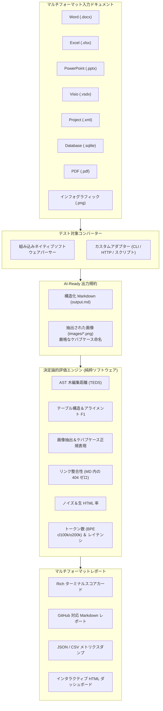

[ [English](ARCHITECTURE.md) | **日本語** ]

# アーキテクチャ設計: AI-Ready ドキュメント変換ベンチマーク (`aiready`)

本書では、`aiready-benchmark` スイートを支えるソフトウェアアーキテクチャ、アルゴリズム、および評価モデルについて詳述します。

---

## 1. システムアーキテクチャの概要



---

## 2. コアアーキテクチャ原則

### 原則 1: 安易な LLM プロンプトを排した決定論的ソフトウェアアルゴリズム
評価器そのものが日によって出力が変わる確率的 LLM であっては、ベンチマークの信頼性は担保できません。本スイートのすべてのメトリクスは、数学的に検証可能な純粋ソフトウェアアルゴリズムによって評価されます：
- **Markdown-it AST パース**: ドキュメントを型付きの抽象構文木（AST）にマッピング。
- **動的計画法（DP）によるシーケンスアライメント**: 予測された AST と正解（Gold）AST 間の正規化構造距離を計算。
- **正規表現＆ファイル inode 相互検証**: 実際のディスクファイルシステムと照合し、リンクの存在と命名規則の整合性を検証。
- **正確な BPE トークン化**: `tiktoken` のバイトコードエンコーディング（`cl100k_base` および `o200k_base`）を用いて正確なトークンフットプリントを測定。

### 原則 2: 厳格な AI-Ready 画像規約（The Strict AI-Ready Image Contract）
Word 文書、PowerPoint スライド、PDF、Visio 図面の中に閉じ込められた画像は、テキスト LLM からは見えません。本ベンチマークでは以下を強制します：
1. **画像抽出**: 画像はコンテナドキュメントから物理的に分離され、`images/` ディレクトリに保存されなければならない。
2. **ケバブケース（kebab-case）の意味的命名**: ファイル名は `^[a-z0-9]+(-[a-z0-9]+)*\.(png|jpe?g|webp|svg)$` に厳密に準拠しなければならない。
3. **本文内リンク**: Markdown 出力内では、有効な Markdown 構文（``）を用いて画像を参照しなければならない。
4. **リンク切れゼロ**: Markdown ファイル内のすべての画像リンクは、ディスク上に実在する画像ファイルを指していなければならない。

### 原則 3: 包括的なエンタープライズ Office フォーマットの網羅
企業の現場には、一般的な Word や PDF 以外にも膨大なアーカイブが存在します。本スイートは以下をネイティブに生成・評価します：
- **Visio (`.vsdx`)**: 図面、シェイプ接続、組み込みスイッチ/ネットワーク機器アセットを含む Open Packaging Conventions (OPC) XML。
- **Project (`.xml`)**: タスク階層、所要期間、進捗率を含む作業分解図（WBS）。
- **リレーショナル DB (`.sqlite` / `.accdb`)**: テーブルスキーマ定義および整形式の Markdown テーブルに変換されたリレーショナルレコード。

---

## 3. 数理評価モデル

### 木編集距離類似度（Tree Edit Distance Similarity: TEDS）
AST を深さ優先探索（DFS）でトラバースし、深さアノテーション付き構造トークンのシーケンスを生成します：
$$\text{Seq} = \big( (d_1, \tau_1, c_1), (d_2, \tau_2, c_2), \dots, (d_N, \tau_N, c_N) \big)$$
ここで、$d$ は木の深さ、$\tau$ はトークンタグ（`heading`, `table`, `tr`, `img`, `paragraph` など）、$c$ はテキスト内容を表します。

予測シーケンス $P$ と正解シーケンス $G$ の間の編集距離 $D(P, G)$ は、深さの差に応じたペナルティを課した動的計画法（DP）アライメントによって算出されます：
$$\text{TEDS} = 1.0 - \frac{D(P, G)}{\max(|P|, |G|)}$$

### AI-Ready 総合指数（AI-Ready Composite Index: ACI）
$$\text{ACI} = \left( 0.30 \cdot S_{\text{TEDS}} + 0.20 \cdot S_{\text{Table}} + 0.25 \cdot S_{\text{Image}} + 0.15 \cdot S_{\text{Clean}} + 0.10 \cdot S_{\text{Heading}} \right) \times 100$$
各項の内訳:
- $S_{\text{TEDS}}$: 正規化木編集距離スコア。
- $S_{\text{Table}}$: 行/列の次元一致度とセル内容オーバーラップの調和平均。
- $S_{\text{Image}}$: 抽出率 (35%)、ケバブケース適合率 (25%)、リンク整合性 (30%)、キーワード一致 (10%) の加重スコア。
- $S_{\text{Clean}}$: 未パースの生 HTML 定型句や制御文字の排除率。
- $S_{\text{Heading}}$: 見出し階層の深さと順序の保持度。

---

## 4. 競合フリーな名前空間ストレージアーキテクチャ

何百人ものコントリビューターがフォークからベンチマーク結果を提出する際、Git マージコンフリクトを発生させずにスケールさせるため、本リポジトリでは**名前空間で分離された実行結果（Namespaced Runs）**と**原子的レビュー（Atomic Reviews）**を徹底しています：

```
submissions/
├── runs/
│   ├── <author_slug>/                                # 作成者ごとの完全な分離
│   │   └── <agent_slug>_v<version>_<short_sha>.json  # コンテンツアドレッシングによる決定論的ファイル名
│   │       ├── run_result (全ベンチマークメトリクス)
│   │       ├── system_env (CPU, OS, Python バージョン)
│   │       └── checksum_sha256 (改ざん防止ハッシュ)
└── reviews/
    └── <agent_slug>/                                 # エージェントごとのディレクトリ
        └── <author_slug>_<review_id>.json            # 1 レビュー = 1 独立ファイル
```

### 競合フリーの主要特性:
1. **独立したファイル Inode**: すべての提出物とレビューは完全に新しいファイルとして保存されます。2 人のコントリビューターが同じファイルパスを編集することは決してありません。
2. **共有配列の排除**: 従来のモノリシックな `reviews.json` や `results.json` は廃止されています。Pull Request は常に追記（新規作成）のみです。
3. **自動再帰取り込み**: マージ時に GitHub Actions ランナーが `aiready build-leaderboard` を実行し、名前空間配下の全ファイルを再帰的にコンパイルして `docs/data/leaderboard.json` を自動更新します。
