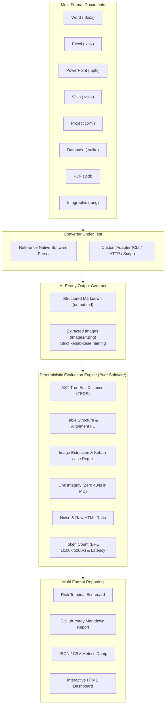

# Architecture Design: AI-Ready Document Conversion Benchmark (`aiready`)

This document outlines the software architecture, algorithms, and evaluation models powering the `aiready-benchmark` suite.

---

## 1. System Architecture Overview

---

## 2. Core Architectural Principles

### Principle 1: Deterministic Software Algorithms Over Lazy LLM Prompts
A benchmark cannot be credible if its evaluator is another stochastic LLM that changes outputs from day to day. Every metric in this suite is evaluated via mathematically verifiable, pure-software algorithms:
- **Markdown-it AST Parsing**: Documents are mapped to typed abstract syntax trees.
- **Dynamic Programming Sequence Alignment**: Computes normalized structural distance between predicted and gold ASTs.
- **Regular Expression & File Inode Cross-Check**: Validates link existence and naming integrity against the actual disk filesystem.
- **Exact BPE Tokenization**: Measures token footprint using `tiktoken` bytecode encodings (`cl100k_base` and `o200k_base`).

### Principle 2: The Strict AI-Ready Image Contract
Images trapped inside Word documents, PowerPoint slides, PDFs, or Visio drawings are opaque to text LLMs. The benchmark enforces that:
1. **Extraction**: Images must be physically decoupled from container documents into an `images/` directory.
2. **Kebab-case Semantic Naming**: File stems must adhere to `^[a-z0-9]+(-[a-z0-9]+)*\.(png|jpe?g|webp|svg)$`.
3. **In-Text Linking**: The Markdown output must reference the image using valid Markdown syntax: ``.
4. **Zero Broken Links**: Every link in the Markdown file must point to an existing image file on disk.

### Principle 3: Comprehensive Enterprise Office Coverage
Enterprises maintain vast archives beyond standard Word and PDF. The suite natively generates and evaluates:
- **Visio (`.vsdx`)**: Open Packaging Conventions (OPC) XML containing diagrams, shape connections, and embedded switch/network assets.
- **Project (`.xml`)**: Work Breakdown Structures (WBS) with task hierarchies, durations, and percentage completions.
- **Relational (`.sqlite` / `.accdb`)**: Table schema definitions and relational rows formatted into clean Markdown tables.

---

## 3. Mathematical Evaluation Models

### Tree Edit Distance Similarity (TEDS)
The AST is traversed in depth-first order to produce a sequence of depth-annotated structural tokens:
$$\text{Seq} = \big( (d_1, \tau_1, c_1), (d_2, \tau_2, c_2), \dots, (d_N, \tau_N, c_N) \big)$$
Where $d$ is the tree depth, $\tau$ is the token tag (`heading`, `table`, `tr`, `img`, `paragraph`), and $c$ is the text content.

The edit distance $D(P, G)$ between predicted sequence $P$ and gold sequence $G$ is calculated via DP alignment with depth-difference penalties:
$$\text{TEDS} = 1.0 - \frac{D(P, G)}{\max(|P|, |G|)}$$

### AI-Ready Composite Index (ACI)
$$\text{ACI} = \left( 0.30 \cdot S_{\text{TEDS}} + 0.20 \cdot S_{\text{Table}} + 0.25 \cdot S_{\text{Image}} + 0.15 \cdot S_{\text{Clean}} + 0.10 \cdot S_{\text{Heading}} \right) \times 100$$
Where:
- $S_{\text{TEDS}}$: Normalized tree edit distance.
- $S_{\text{Table}}$: Harmonic mean of row/column dimension match and cell content overlap.
- $S_{\text{Image}}$: Weighted score of extraction rate (35%), kebab-case compliance (25%), link integrity (30%), and keyword match (10%).
- $S_{\text{Clean}}$: Freedom from raw unparsed HTML boilerplate and control characters.
- $S_{\text{Heading}}$: Preservation of heading hierarchy depth and order.
